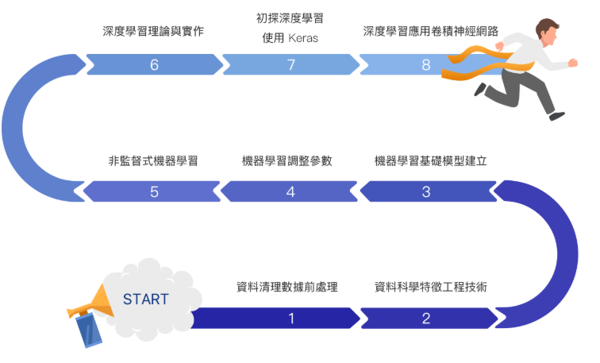

# [ML100Days](https://ai100-2.cupoy.com/) 

  

#### Part 1 Clean Data and Data Preprocessing (資料清理數據前處理)
- Day 01 : Data Introduction and Assessment / *資料介紹與評估資料
- Day 02 : Exploratory Data Analysis(EDA) / *讀取資料EDA: Data summary
- Day 03 : Build Pandas DataFrame / *新建dataframe
- Day 04 : Pandas Data Types / *欄位的資料類型介紹及處理
- Day 05 : EDA Distribution / *資料分佈
- Day 06 : Handle Outlier Data / *Outlier及處理
- Day 07 : Normalize Continuous Data / *常用的數值取代：中位數與分位數連續數值標準化
- Day 08 : DataFrame operation / *常用的 DataFrame 操作
- Day 09 : EDA Correlation 1 / 程式實作: correlation/相關係數簡介
- Day 10 : EDA Correlation 2 / EDA from Correlation
- Day 11 : Kernal Density Estimation (KDE) / 不同數值範圍間的特徵如何檢視/繪圖與樣式Kernel Density Estimation (KDE)
- Day 12 : Discretization Method / 把連續型變數離散化
- Day 13 : Implement Discretization Method / 程式實作:把連續型變數離散化
- Day 14 : Subplot using Matplotib / 繪製子圖
- Day 15 : Heatmap and Grid-plot / 繪製Heatmap & Grid-plot
- Day 16 : Logistic Regression 模型初體驗 Logistic Regression

#### Part 2 Feature Engineering (資料科學特徵工程技術)
- Day 17 : Introduction of Feature Engineering / 特徵工程簡介
- Day 18 : Feture Types / 特徵類型
- Day 19 : [Value Type] Insert Value for Lost Information / 數值型特徵-補缺失值與標準化
- Day 20 : [Value Type] Remove Outlier / 數值型特徵 - 去除離群值
- Day 21 : [Value Type] Remove Bias / 數值型特徵 - 去除偏態
- Day 22 : [Class Type] One-Hot and Label Encoding / 類別型特徵 - 基礎處理
- Day 23 : [Class Type] Mean Encoding / 類別型特徵 - 均值編碼
- Day 24 : [Class Type] Other Advanced Processing / 類別型特徵 - 其他進階處理
- Day 25 : [Time Type] Time Cycle / 時間型特徵
- Day 26 : Feature Combination (Value and Value) / 特徵組合 - 數值與數值組合
- Day 27 : Feature Combination (Value and Class) / 特徵組合 - 類別與數值組合
- Day 28 : Feature Selection / 特徵選擇
- Day 29 : Feature Estimation / 特徵評估
- Day 30 : Leaf Encoding on Class Type Feature / 分類型特徵優化 - 葉編碼

#### Part 3 Machine Learning Model Building (機器學習基礎模型建立)
- Day 31 : Introduction of Machine Learning / 機器學習概論
- Day 32 : Framework and Process in Machine Learning / 機器學習-流程與步驟
- Day 33 : How to Teach Machine? / 機器如何學習?
- Day 34 : Split Training and Evaluation Set / 訓練/測試集切分的概念
- Day 35 : Regression vs. Classification / 迴歸 vs. 分類
- Day 36 : Evaluation Metrics / 評估指標選定
- Day 37 : Regression Model Introdoction (Linear / Logistic) / 迴歸模型介紹 - 線性迴歸/羅吉斯迴歸
- Day 38 : Rgression Model Implement (Linear / Logistic) / 程式實作: 線性迴歸/羅吉斯回歸
- Day 39 : Regression Model Introdoction (LASSO / Ridge) 迴歸模型介紹 - LASSO 迴歸/ Ridge 迴歸
- Day 40 : Rgression Model Implement (LASSO / Ridge) / 程式實作: LASSO 迴歸/ Ridge 迴歸
- Day 41 : Tree Based Model Introdoction (Decision Tree) / 決策樹介紹
- Day 42 : Tree Based Model Implement (Decision Tree) / 程式實作: 決策樹
- Day 43 : Tree Based Model Introdoction (Random Forest) / 隨機森林介紹
- Day 44 : Tree Based Model Implement (Random Forest) / 程式實作:隨機森林介紹
- Day 45 : Tree Based Model Introdoction (Gradient Boosting Machine) / 梯度提升機介紹
- Day 46 : Tree Based Model Implement (Gradient Boosting Machine) / 程式實作: 梯度提升機

#### Part 4 Machine Learning Fine-tuning (機器學習調整參數)
- Day 47 : Hyper-Parameters Tuning and Optimization / 超參數調整與優化
- Day 48 : Introduction of Kaggle / Kaggle 競賽平台介紹
- Day 49 : Bleding Method / 集成方法 : 混合泛化
- Day 50 : Stacking Method / 集成方法 : 堆疊泛化

#### Mid-Term Exam
- Day 51 : Mid-Term Exam (1/3) / 期中考:優惠券使用預測
- Day 52 : Mid-Term Exam (2/3) / 期中考:優惠券使用預測
- Day 53 : Mid-Term Exam (3/3) / 期中考:優惠券使用預測

#### Part 5 Unsupervised Learning (非監督式機器學習)
- Day 54 : Introduction of Unsupervised Learning / 非監督式機器學習簡介
- Day 55 : Clustering Method / 聚類算法
- Day 56 : K-Mean / K-mean 觀察: 使用輪廓分析
- Day 57 : Hierarchical Clustering / 階層分群算法
- Day 58 : Hierarchical Clustering on 2D Toy Dataset / 階層分群法 觀察 :使用2D樣版資料集
- Day 59 : Dimension Reduction - PCA / 降維方法-主成份分析
- Day 60 : PCA on MNIST / PCA 觀察:使用手寫辨識資料集
- Day 61 : Dimension Reduction - T-SNE / 降維方法-T-SNE
- Day 62 : T-SNE Implement / t-sne 觀察: 分群與流形還原

#### Part 6 Deep Learning Theory and Implement (深度學習理論與實作)
- Day 63 : Introduction of Neural Netork / 神經網路介紹
- Day 64 : Experience on TensorFlow PlayGround (Learning Rate) / 深度學習體驗 : 模型調整與學習曲線
- Day 65 : Experience on TensorFlow PlayGround (Activation Function/ Regularization) / 深度學習體驗 : 啟動函數與正規化

#### Part 7 Deep Learning on Keras (初探深度學習使用 Keras)
- Day 66 : Introducion of Keras / Keras 安裝與介紹
- Day 67 : Keras Dataset / Keras 資料集
- Day 68 : Keras Sequential API / 序列模型搭建網路
- Day 69 : Keras Module API / Keras Module API的介紹與應用
- Day 70 : Multi-Layer Perception (MLP) / 多層感知簡介
- Day 71 : Loss Functions / 損失函數的介紹與應用
- Day 72 : Activation Function / 啟動函數的介紹與應用
- Day 73 : Gradient Descend (1/2) / 梯度下降簡介
- Day 74 : Gradient Descend (2/2) / 梯度下降的基礎數學原理介紹
- Day 75 : Back Propagation / 反向式傳播簡介
- Day 76 : Optimizers / 優化器簡介
- Day 77 : Validation and Overfitting / 訓練神經網路的細節與技巧:驗證與過擬合
- Day 78 : KeyNote before Training Model / 訓練神經網路前的注意事項
- Day 79 : Learning Rate Effect / 訓練神經網路的細節與技巧 - 學習率的影響
- Day 80 : Combination of Optomizer and Learning Rate / 優化器與學習率的組合與比較
- Day 81 : Avoid Overfitting - Regularization / 訓練神經網路的細節與技巧 - 正規化
- Day 82 : Avoid Overfitting - Dropout / 訓練神經網路的細節與技巧 - 隨機缺失
- Day 83 : Avoid Overfitting - Batch Normalization / 訓練神經網路的細節與技巧 - 批次正規化
- Day 84 : Avoid Overfitting - Hyper-Parameters Tuning and Comparison / 正規化/隨機移除/批次標準化的組合與比較
- Day 85 : Avoid Overfitting - Early Stop / 訓練神經網路的細節與技巧 - 煞車機制
- Day 86 : Saving and Restoring Model / 訓練神經網路的細節與技巧 - 儲存 model
- Day 87 : Learning Rate Decay / 訓練神經網路的細節與技巧 - 做學習率遞減
- Day 88 : Design your Keras Callbacks Function / 訓練神經網路的細節與技巧 - 撰寫自己的callbacks函數
- Day 89 : Design your Loss Funciton / 訓練神經網路的細節與技巧 - 撰寫自己的損失函數
- Day 90 : Image Recognition using Tranditional Computer Vsion Methods / 使用傳統電腦視覺與機器學習進行影像辨識
- Day 91 : Image Recognition using Machine Learning Model / 使用傳統電腦視覺與機器學習進行影像辨識

#### Part 8 Convolutional Neural Network (CNN) in Deep Learning (深度學習應用卷積神經網路)
- Day 92 : Introdoction of CNN (1/2) / 卷積神經網路簡介
- Day 93 : Introdoction of CNN (2/2) / 卷積神經網路架構細節
- Day 94 : Parameters Tuning in CNN Layer / 卷積神經網路 - 卷積層與參數調整
- Day 95 : Pooling Layer in Keras / 卷積神經網路 - 池化層與參數調整
- Day 96 : CNN Layer in Keras / Keras 中的 CNN layers
- Day 97 : CNN vs. DNN on CIFAR-10 / 使用 CNN 完成 CIFAR-10 資料集
- Day 98 : Data Generator in Keras / 訓練卷積神經網路的細節與技巧 - 處理大量數據
- Day 99 : Data Augmentation in Keras / 訓練卷積神經網路的細節與技巧 - 處理小量數據
- Day 100 : Transfer Learning / 訓練卷積神經網路的細節與技巧 - 轉移學習 (Transfer learning)

#### Final Exam
- Day 101 : Final Exam (1/3) / 期末考: 透過 CNN 進行貓狗影像分類
- Day 102 : Final Exam (2/3) / 期末考: 透過 CNN 進行貓狗影像分類
- Day 103 : Final Exam (3/3) / 期末考: 透過 CNN 進行貓狗影像分類

#### Part 9 Bonus (進階補充)
- Day 104 : 互動式網頁神經網路視覺化
- Day 105 : CNN卷積網路回顧
- Day 106 : 常見影像資料集介紹 (Cifar-10, ImageNet, COCO)
- Day 107 : 電腦視覺應用介紹 - 影像分類, 影像分割, 物件偵測

